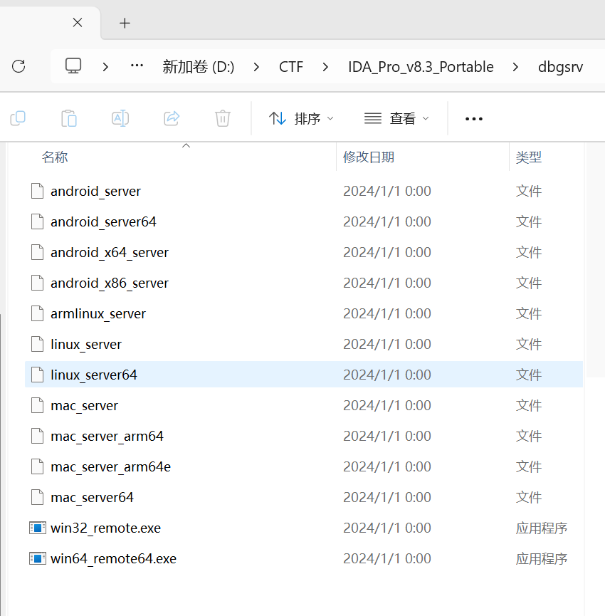
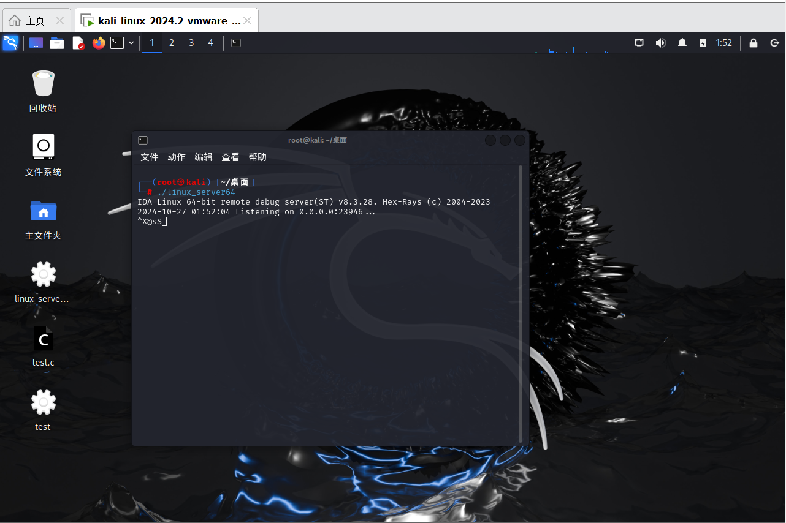
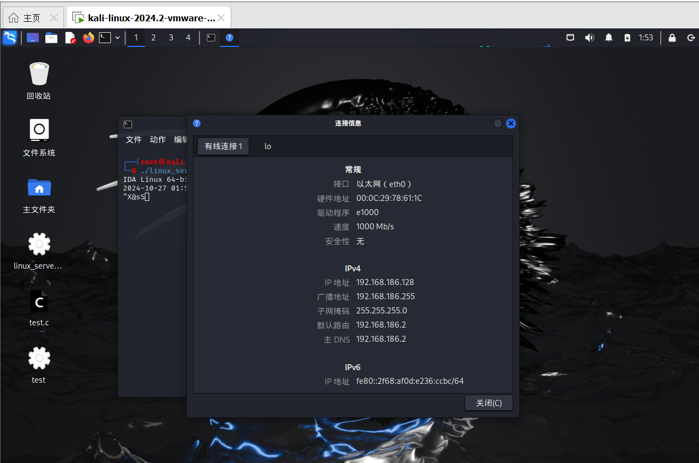
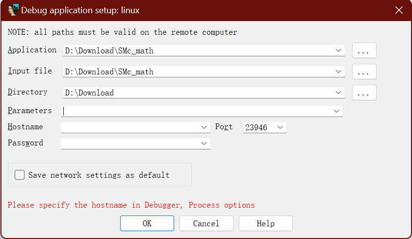
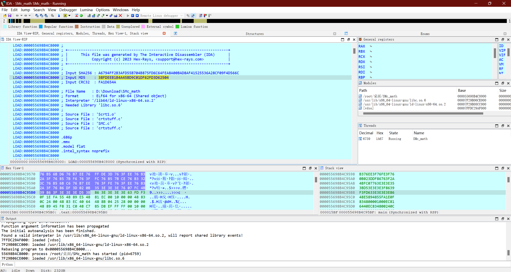

最近在做Newstar Week3的时候，SMc_math用IDApython莫名奇妙的少一个方程，于是索性配置一下linux动调的环境

# 配置前准备

IDA Pro、kali虚拟机

# 具体步骤

## 文件配置

从IDA的本地文件中找到dbgsrv文件夹，将里面的文件复制到kali虚拟机中，这里我使用的64位虚拟机，所以需要复制的是linux_server64



## 在kali中激活文件

在桌面打开命令行输入

```cmd
./linux_server64
```



## 获取kali虚拟机的ip

右键联网选项打开连接信息可以获得ip地址，或者在命令行中输入ifconfig也可以



## 配置IDA远程调试

使用IDA打开文件，在动调选项中选择Remote Linux debugger，运行后会出现这个界面



把刚刚在kali中获取到的ip输入到Hostname中，一路OK即可顺利开始调试 ↓



# 总结

本来还以为配置linux的动调比较麻烦，没想到这么简单，早知道早点搞了XD