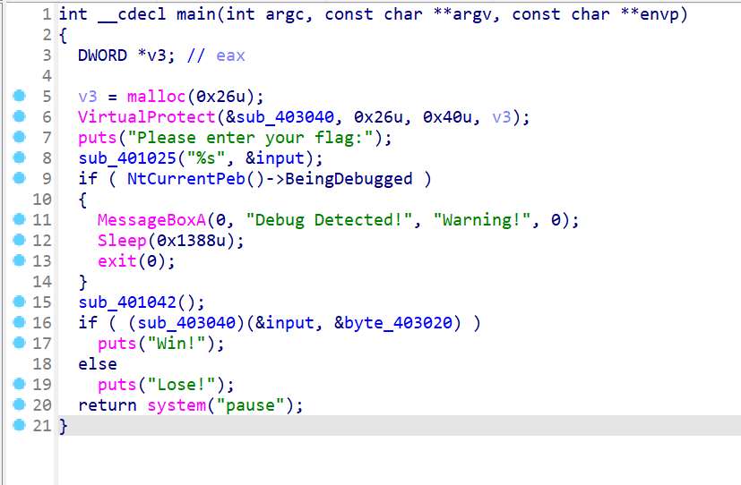
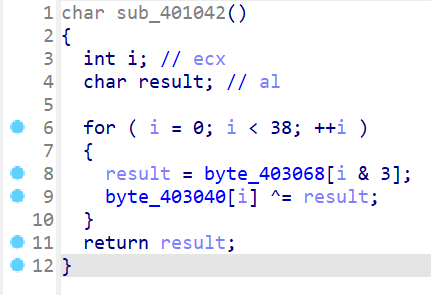
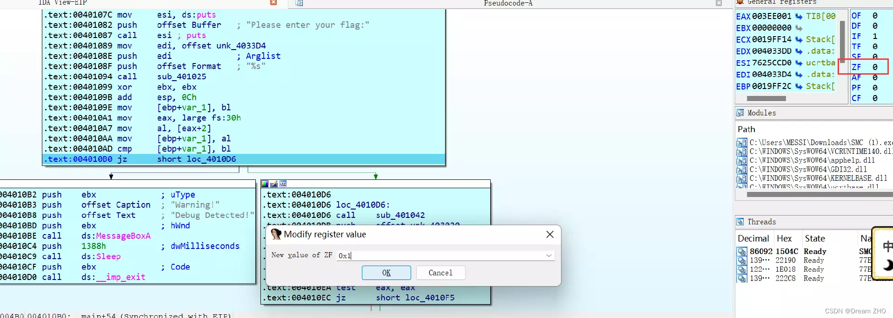
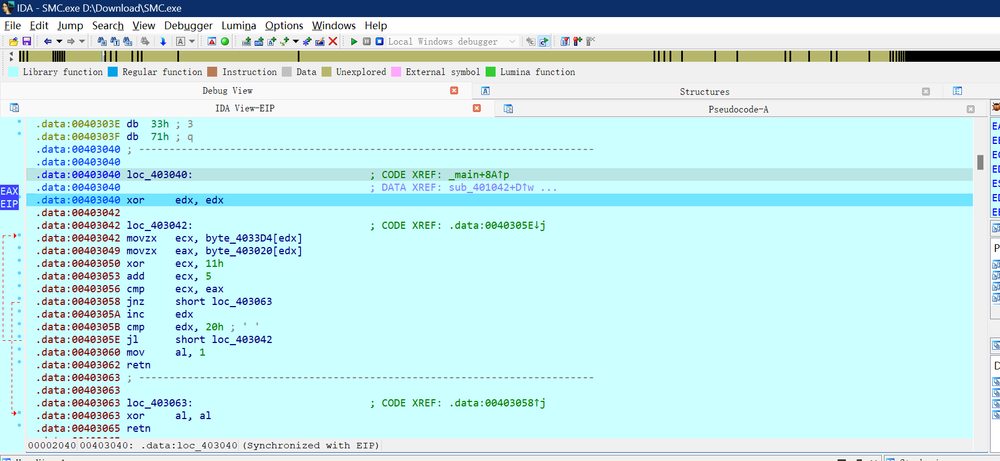
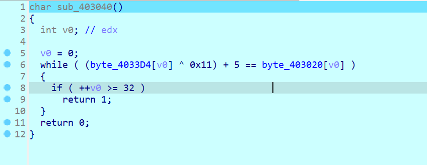
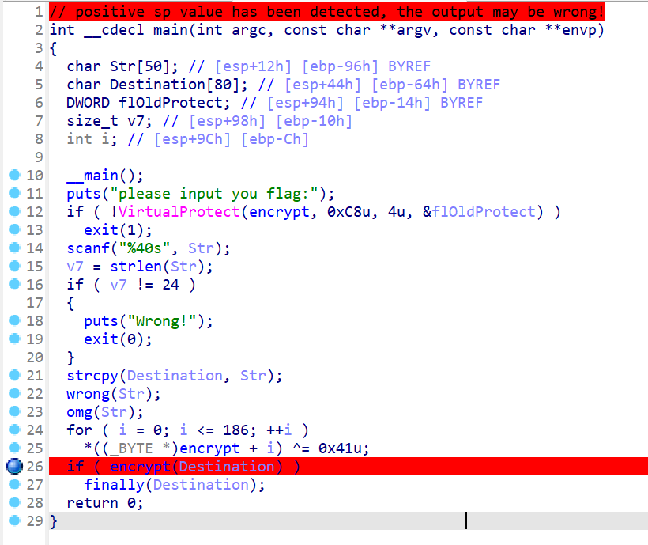
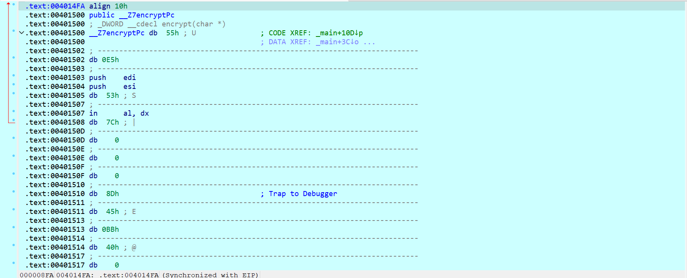
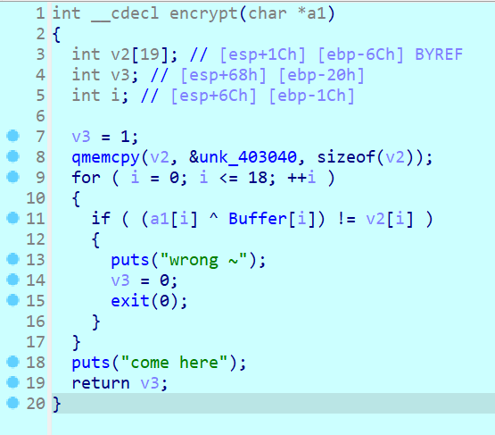
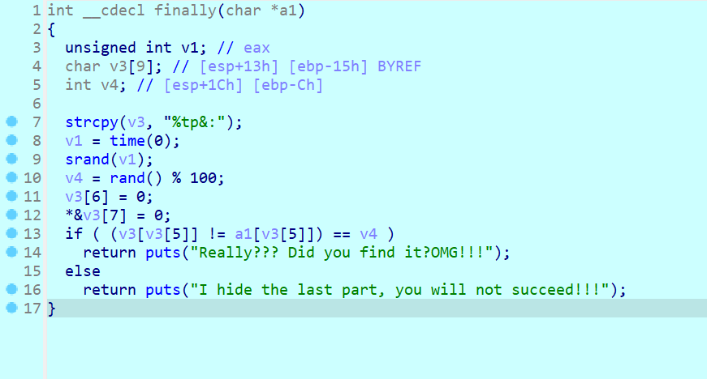

# SMC介绍

## 简介

SMC，即Self Modifying Code，动态代码加密技术，指通过修改代码或数据，阻止别人直接静态分析，然后在动态运行程序时对代码进行解密，达到程序正常运行的效果。
SMC的实现方式有很多种，可以通过修改PE文件的Section Header、使用API Hook实现代码加密和解密、使用VMProtect等第三方加密工具等。

## 解决方案

通常我们应该先寻找被修改的代码，然后开始找有没有自解密函数，接着通过静态分析结合动调恢复被修改的代码

# 例题分析

## NewStar 2023 SMC

IDA打开发现有反调试和VirtualProtect，可以发现是SMC

可以发现sub_403040被修改了，打开sub_401042( )函数可以发现403040这个数据是经过异或的，可以判断这个就是自解密函数

接着通过打断点进行动调，修改ZF标志位为1绕过反调试

接着继续调试，经过自解密函数后，可以来到403040的部分

按P创建函数，之后F5反编译，即可恢复原来的代码

根据代码解出flag即可

## 网鼎杯 2020 青龙组 jocker

老规矩找到判断的函数Encrypt，发现打不开，可以判断是SMC，接着打开wrong和omg，可以发现是没啥用的假Flag，并不会阻拦之后的encrypt异或解密

我们随便输入一个24长度的字符串，打断点来到encrypt部分

先从401500定义头开始一直选中代码直到endp，U键取消定义，然后P键重新定义函数，即可恢复encrypt和finally函数的逻辑

通过这两段代码即可解出flag