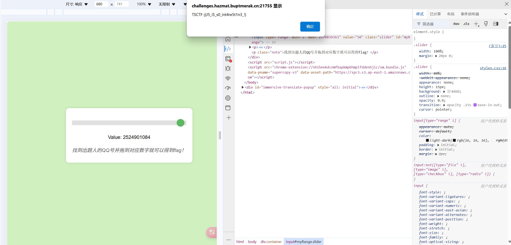
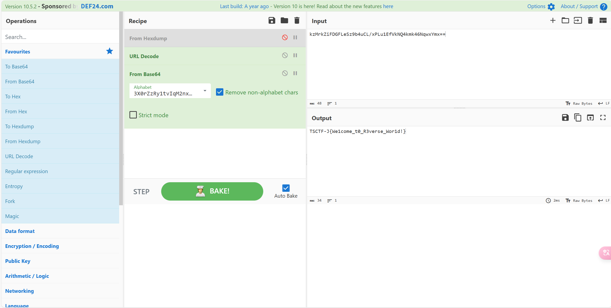
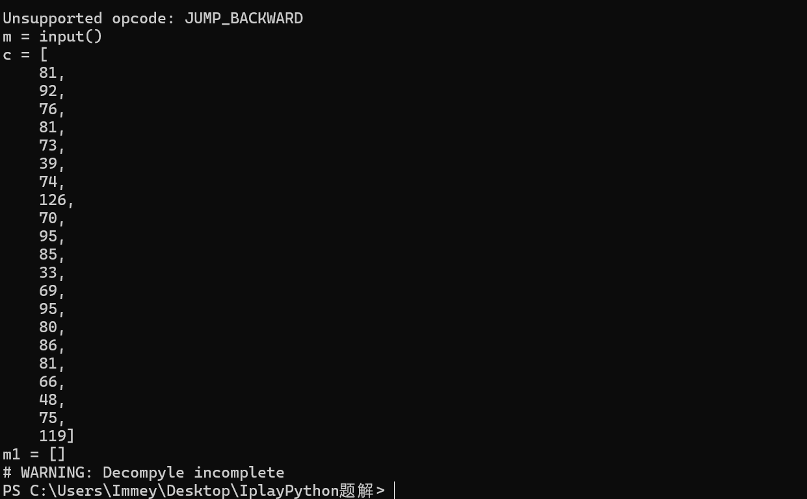
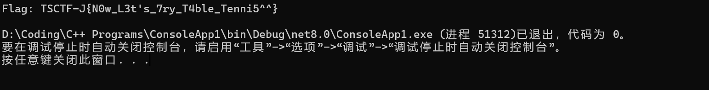
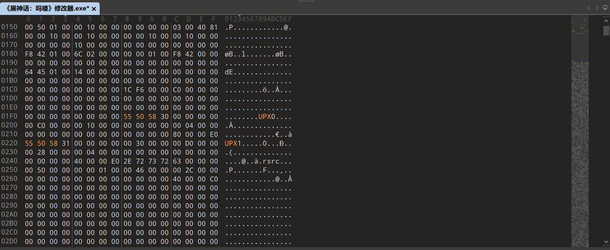
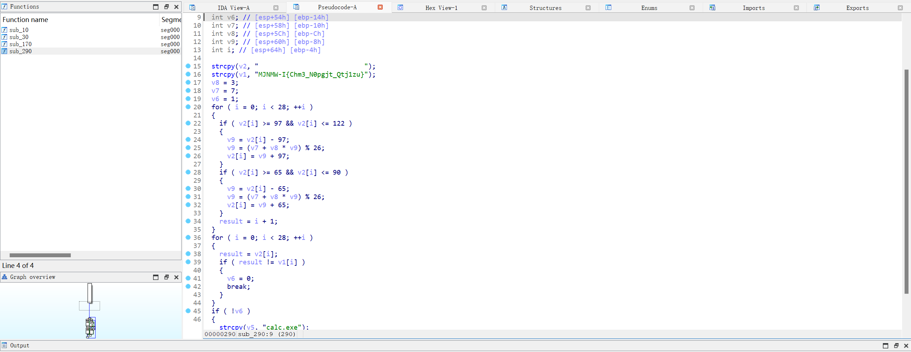
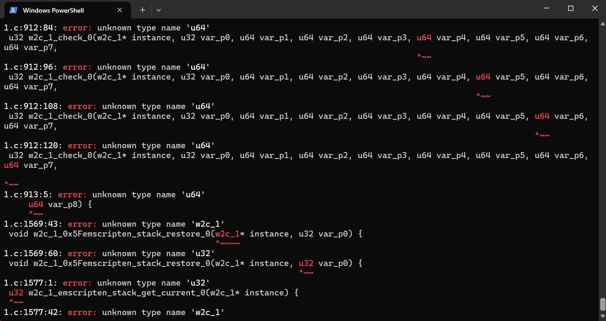

# 一、Web

## 1.set set what


F12 修改进度条的最大值为出题人QQ号即可获得flag
（做个签到就跑)

# 二、Reverse

## 1.iPlayIDA

打开文件发现是换表base64
先求出新的Base64表

```python
v1 = [
    114, 26, 115, 54, 31, 60, 21, 49, 120, 62,
    61, 5, 60, 3, 125, 62, 41, 53, 23, 7,
    58, 61, 32, 20, 48, 63, 46, 0, 50, 2,
    46, 11, 6, 49, 10, 83, 3, 47, 59, 41,
    46, 58, 73, 22, 3, 50, 55, 93, 39, 79,
    55, 63, 101, 68, 6, 28, 88, 0, 97, 99,
    112, 15, 65, 92
]
string = 'ABCDEFGHIJKLMNOPQRSTUVWXYZabcdefghijklmnopqrstuvwxyz0123456789+/'
new = ''
for i in range(len(v1)):
    new += chr(ord(string[i])^v1[i])
print(new)
#3X0rZzRy1tvIqM2nxgDSokwLieObQfKmaYc9hCVGAJ8dpFB+P7NEUu4/l5WTH6js
```

后放入CyberChef即可得到flag


## 2.iPlayPython

先用pydumpck反编译exe文件
随后发现文件夹里没有py文件（一开始以为是出bug了，没想到是只能反汇编）遂改用反编译pyc文件
补全pyc文件头后用pycdc发现反编译不完全

于是上网查资料发现还能反汇编，编写反汇编脚本后得到汇编代码

```python
import dis
import marshal
f = open(r"task.pyc", "rb").read()
code = marshal.loads(f[16:])
dis.dis(code)
```

得到一长串汇编代码，翻译成python代码

```python
m = input()
c = [81, 92, 76, 81, 73, 39, 74, 126, 70, 95, 85, 33, 69, 95, 80, 86, 81, 66, 48, 75, 119]
m1 = []
if len(m) != 21:
    print("Sorry, you are wrong!")
else:
    for i in range(21):
        m1.append(
            ((ord(m[i]) & 3) * 4) |
            ((ord(m[i]) & 12) >> 2) |
            (ord(m[i]) & 240)
        )
    i = 0
    while i < 21:
        if m1[i] != c[i]:
            print("Sorry, you are wrong!")
            break
        i += 1
    else:
        print("Congratulations! You are right!")

```

可以写出解题脚本

```python

c = [81, 92, 76, 81, 73, 39, 74, 126, 70, 95, 85, 33, 69, 95, 80, 86, 81, 66, 48, 75, 119]
ascii_range = range(32, 127)
flag = [''] * 21
for i in range(21):
    for char in ascii_range:
        result = (char & 3) * 4 | (char & 12) >> 2 | (char & 240)
        if result == c[i]:
            flag[i] = chr(char)
            break

flag_str = ''.join(flag)

print("Flag:", flag_str)
#Flag: TSCTF-J{I_U$E_PYTH0N}
```

## 3.iPlayPinball

打开附件发现是一个unity编写的游戏，要求达到810975分才算过关
第一想法是用cheat engine修改分数，但是失败了，看到hint后尝试unity逆向
把Assembly-CSharp.dll放入Dnspy后可以清楚看到游戏逻辑，其中DisplayWinMessage是Flag所在部分，使用的是Z3，直接把他单独提出来稍微修改一下运行，可以得到Flag

```c#
using System;
using System.Text;
using Microsoft.Z3;

public class Program
{
    public static void Main(string[] args)
    {
        StringBuilder stringBuilder = new StringBuilder();
        using (Context context = new Context())
        {
            IntExpr[] array = new IntExpr[37];
            for (int i = 0; i < array.Length; i++)
            {
                array[i] = context.MkIntConst($"m[{i}]");
            }
			//省略前面的方程
			BoolExpr boolExpr38 = context.MkAnd(new BoolExpr[]
			{
			    boolExpr,
			    boolExpr2,
			    boolExpr3,
			    boolExpr4,
			    boolExpr5,
			    boolExpr6,
			    boolExpr7,
			    boolExpr8,
			    boolExpr9,
			    boolExpr10,
			    boolExpr11,
			    boolExpr12,
			    boolExpr13,
			    boolExpr14,
			    boolExpr15,
			    boolExpr16,
			    boolExpr17,
			    boolExpr18,
			    boolExpr19,
			    boolExpr20,
			    boolExpr21,
			    boolExpr22,
			    boolExpr23,
			    boolExpr24,
			    boolExpr25,
			    boolExpr26,
			    boolExpr27,
			    boolExpr28,
			    boolExpr29,
			    boolExpr30,
			    boolExpr31,
			    boolExpr32,
			    boolExpr33,
			    boolExpr34,
			    boolExpr35,
			    boolExpr36,
			    boolExpr37
			});
            Solver solver = context.MkSolver();
            solver.Assert(boolExpr38);
            if (solver.Check() == Status.SATISFIABLE)
            {
                Model model = solver.Model;
                for (int j = 0; j < array.Length; j++)
                {
                    stringBuilder.Append((char)int.Parse(model.Evaluate(array[j], false).ToString()));
                }
                Console.WriteLine("Flag: " + stringBuilder.ToString());
            }
        }
    }
}

```



## 4.iPlayApple

查了好久都没找到windows下逆向ipa文件的方法，遂放弃：（

## 5.iPlayCalc

首先用die查壳，发现是upx魔改壳，于是用010editor打开发现是修改了标志位，把标志位修改回来便能够正常脱壳

脱壳后用IDA打开，结合hint给出的提示“shellcode加载器”，开始着手分析shellcode的内容，将shellcode经过Base64解码后写入.bin文件

```python
hex_string = "e98b020000cccccccccccccccccccccc33c064a1300000008b400c8b400c8b308b368bc68b4018c3cccccccccccccccc558bec83ec3cc645c447c645c565c645c674c645c750c645c872c645c96fc645ca63c645cb41c645cc64c645cd64c645ce72c645cf65c645d073c645d173c645d200c745ec000000008b45088945e88b4de88b550803513c8955e48b45e483c0188945e0b9080000006bd1008b45e08b4d08034c1060894df08b55f08b450803421c8945d48b4df08b55080351248955d88b45f08b4d08034820894ddcc745fc000000008d55c48955f4c745f800000000eb098b45f883c0018945f88b4df08b55f83b511873708b45f88b4ddc8b55080314818955fc8b45fc0fbe0885c974248b55fc0fbe028b4df40fbe113bc275148b45fc83c0018945fc8b4df483c101894df4ebd28b55fc0fbe028b4df40fbe113bc275188b45f88b4dd80fb714418b45d48b4d08030c90894deceb0b8d55c48955f4e97cffffff8b45ec8be55dc3cccc558bec83ec30e895feffff50e8affeffff83c4048b4d0889410cc645d04cc645d16fc645d261c645d364c645d44cc645d569c645d662c645d772c645d861c645d972c645da79c645db41c645dc008d55d052e849feffff508b45088b480cffd18b55088902c645ec6dc645ed73c645ee76c645ef63c645f072c645f174c645f22ec645f364c645f46cc645f56cc645f600c645f873c645f979c645fa73c645fb74c645fc65c645fd6dc645fe008d45f8508d4dec518b55088b02ffd0508b4d088b510cffd28b4d08894104c645e043c645e172c645e265c645e361c645e474c645e546c645e669c645e76cc645e865c645e941c645ea008d55e052e8a0fdffff508b45088b480cffd18b55088942088be55dc3cccccccccccccccccccccccccc558bec83ec68c645b420c645b520c645b620c645b720c645b820c645b920c645ba20c645bb20c645bc20c645bd20c645be20c645bf20c645c020c645c120c645c220c645c320c645c420c645c520c645c620c645c720c645c820c645c920c645ca20c645cb20c645cc20c645cd20c645ce20c645cf00c645984dc645994ac6459a4ec6459b4dc6459c57c6459d2dc6459e49c6459f7bc645a043c645a168c645a26dc645a333c645a45fc645a54ec645a630c645a770c645a867c645a96ac645aa74c645ab5fc645ac51c645ad74c645ae6ac645af31c645b07ac645b175c645b27dc645b300c745f403000000c745f007000000c745ec01000000c745fc00000000eb098b45fc83c0018945fc837dfc1c0f8d990000008b4dfc0fbe540db483fa617c3d8b45fc0fbe4c05b483f97a7f308b55fc0fbe4415b483e8618945f88b45f80faf45f40345f099b91a000000f7f98955f88b55f883c2618b45fc885405b48b4dfc0fbe540db483fa417c3d8b45fc0fbe4c05b483f95a7f308b55fc0fbe4415b483e8418945f88b45f80faf45f40345f099b91a000000f7f98955f88b55f883c2418b45fc885405b4e954ffffffc745fc00000000eb098b4dfc83c101894dfc837dfc1c7d1f8b55fc0fbe4415b48b4dfc0fbe540d983bc27409c745ec00000000eb02ebd2837dec007537c645e063c645e161c645e26cc645e363c645e42ec645e565c645e678c645e765c645e8008d45d050e8c6fcffff83c4048d4de051ff55d48be55dc3cccccccccccccccc"
binary_data = bytes.fromhex(hex_string)
with open("shellcode.bin", "wb") as binary_file:
    binary_file.write(binary_data)
```

再把他使用IDA打开(一开始尝试好久都是空白，后面才知道是处理器类型的区别，涨知识了)得到伪代码
一眼找到有flag特征的伪代码，分析伪代码可以写出exp

```python
def decrypt_flag():
    v1 = "MJNMW-I{Chm3_N0pgjt_Qtj1zu}"
    v2 = [''] * len(v1)
    v6 = 7
    v7 = 3
    for i in range(len(v1)):
        char = v1[i]
        if 'a' <= char <= 'z':
            original_pos = (ord(char) - 97 - v6) * pow(v7, -1, 26) % 26
            v2[i] = chr(original_pos + 97)
        elif 'A' <= char <= 'Z':
            original_pos = (ord(char) - 65 - v6) * pow(v7, -1, 26) % 26
            v2[i] = chr(original_pos + 65)
        else:
            v2[i] = char
    return ''.join(v2)
flag = decrypt_flag()
print("Flag:", flag)
#TSCTF-J{Hat3_C0urse_Des1gn}
```

## 6.iPlayTarot

发现是C#编写的，用Dnspy打开，定位到几个关键函数，发现EncrypClass函数好像是类似RC4的加密，但是一直分析不明白CheckClass的逻辑，以及到底和日麻有啥关系，遂放弃（现在开始打雀魂来得及吗XD）

## 7.iPlayBingo

提取到wasm文件后，成功使用wabt将其处理成为了.c和.h文件，但是在编译成为IDA可分析的.o文件时报错了，并且前面的题还没做出来，遂放弃


## 8.iPlayMaze

好狠的迷宫题TAT,比moe的迷宫难好多，简单分析了一下TLS函数和去除花指令后就放弃了（SMC和反调试的处理还不是很熟练）

## 9.iPlayDuolingo

没有尝试

# 三、后记

很开始能够参加这次新生赛，虽然感受到了头脑风暴的感觉，但是很开心在做题的过程中学到了很多东西，非常感谢出题人的指导！这次新生赛对我来说也肯定是一段难忘的经历，很不幸在比赛刚开始的中午发现自己莫名奇妙阳了（关键时候掉链子），顶着发烧刀片嗓和虚冷在做题（但是周六在布洛芬的帮助下还是被硬控在床上到下午四点XD）最后，还是希望自己能够进入战队，向学长学姐们多多学习（挂哥简直是我心目中的逆向大神，太强了）
