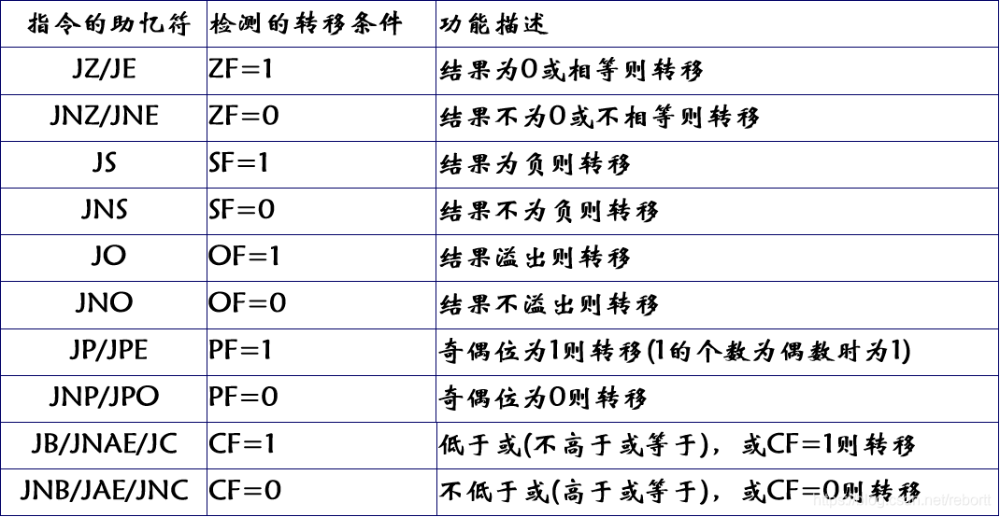
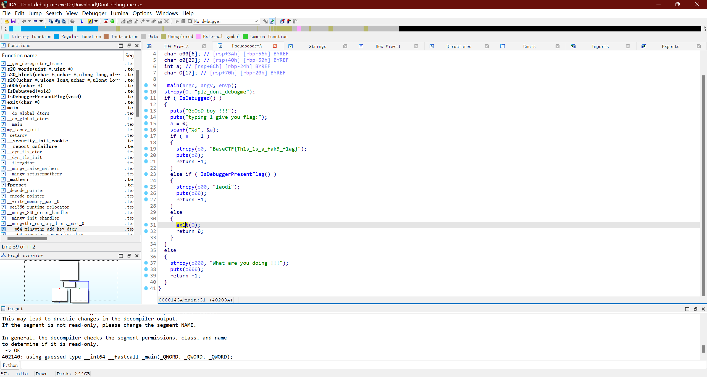
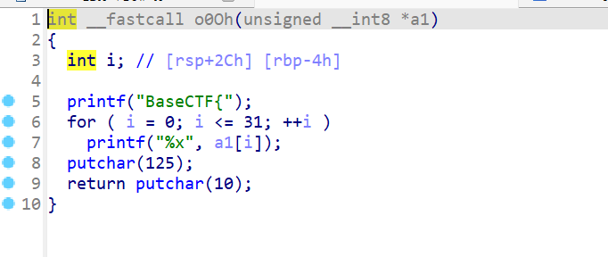
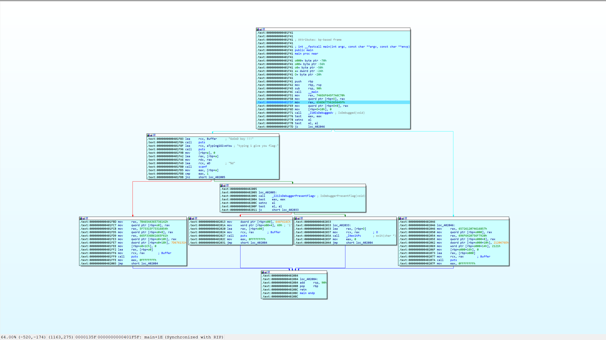
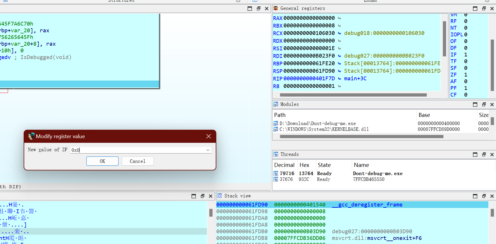
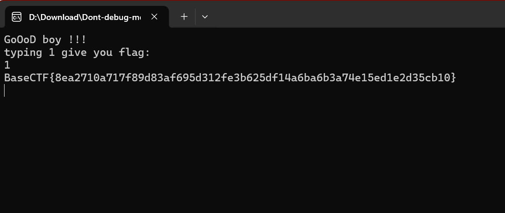

# 前言

之前在做BaseCTF的Dont-debug-me的时候，第一次认识到了标志寄存器的作用，索性整理一下~

# 标志寄存器与汇编语言的跳转

## 标志寄存器

CPU内部的寄存器中，有一种特殊的寄存器具有以下三种作用。
1.用来存储相关指令的某些执行结果；
2.用来为CPU执行相关指令提供行为依据；
3.用来控制CPU的相关工作方式；

这种特殊的寄存器被称为标志寄存器（EFLAG），x86的标志寄存器有32位。

具体每个标志寄存器代表了什么，可以参考学姐的博客[汇编语言中的标志寄存器及其相关指令 | Cabelis's lab](https://cabelis.ink/2022/11/22/assembly-flag/)

## 汇编跳转指令

在汇编语言中，程序的流程控制是通过各种跳转指令来实现的。跳转指令分为条件跳转和无条件跳转

### 无条件跳转指令

无条件跳转指令只有一个，也就是jmp，jmp指令可以直接跳转到的相应的地址，关于具体跳转指令的汇编代码分析，先挖个坑下次再做吧（

### 条件跳转指令

条件跳转指令是本文的重点内容，他在程序流程控制中起到了很大的作用，同时也是判断逻辑实现的重要组成部分，我们可以通过下面的表格从而知道条件跳转指令与标志寄存器的关系

而通过在动调的时候修改条件寄存器的值，我们就可以实现人为控制程序流程：）

# 例题分析

现在我们来分析一下Dont-debug-me

打开题目我们能看到很多反调试，打开ex1t函数，能在里面看到o0Oh函数，里面的逻辑很清晰，也就是绕过反调试他就会自己输出flag

我们打断点在第一个if处开始动调

从流程图我们可以看到，想要到达ex1t函数需要经过两个jz跳转和一个jnz跳转，通过前置知识我们知道了可以修改标志寄存器实现跳转

（贴个动调常用按键：使用F7 调试的时候遇到方法体的时候会进入到方法体内部  每个方法依次执行；使用F8 调试的时候 遇到方法体不会进入方法内部 只会依次执行）

于是我们F8直到跳转语句，可以看到绿色箭头闪烁，这是代表他要跳转到右边了，这时候我们双击右边的ZF标志器并修改为0

可以看到程序跳转的方向变了，按照此方法处理完剩下的跳转，即可在控制台看到flag

