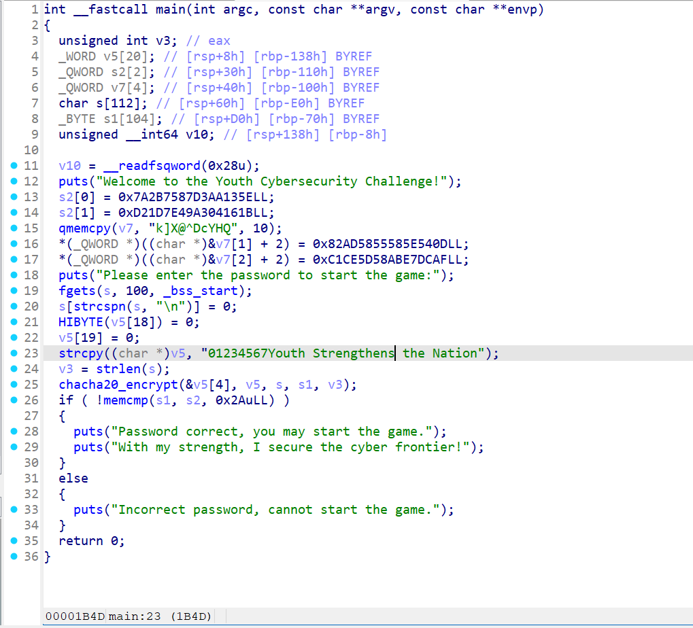
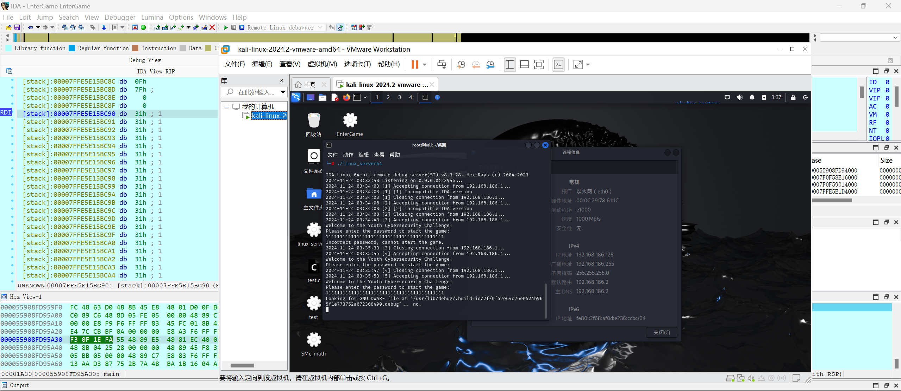
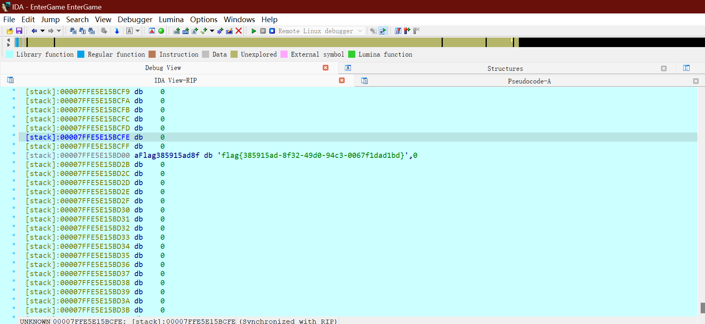
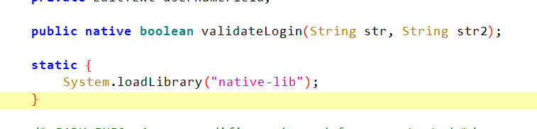
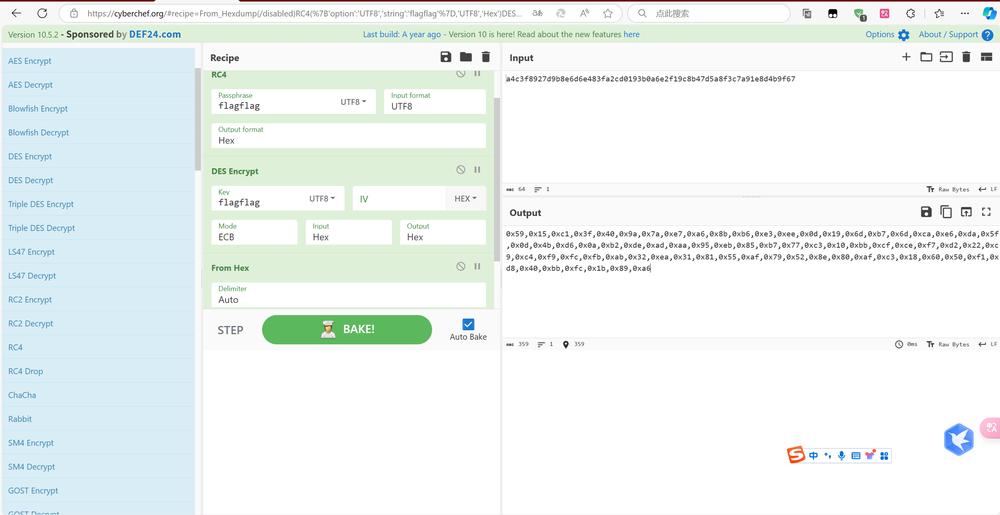

## EnterGame

先用DIE查壳，发现无壳后用IDA打开



发现chacha20，是个对称密码，考虑直接patch输入密文

在判断的地方打个断点

直接动调



把密文patch输入



得到flag

## Flip_over

下载附件用Jadx打开



发现关键函数在native-lib里，用IDA反编译解包的so文件，可以发现加密逻辑是先过RC4，再过DES，最后再过一个异或，看了一下没有魔改，可以先用cyberchef处理之后再最后异或



```python
cipher1 = [0x59,0x15,0xc1,0x3f,0x40,0x9a,0x7a,0xe7,0xa6,0x8b,0xb6,0xe3,0xee,0x0d,0x19,0x6d,0xb7,0x6d,0xca,0xe6,0xda,0x5f,0x0d,0x4b,0xd6,0x0a,0xb2,0xde,0xad,0xaa,0x95,0xeb,0x85,0xb7,0x77,0xc3,0x10,0xbb,0xcf,0xce,0xf7,0xd2,0x22,0xc9,0xc4,0xf9,0xfc,0xfb,0xab,0x32,0xea,0x31,0x81,0x55,0xaf,0x79,0x52,0x8e,0x80,0xaf,0xc3,0x18,0x60,0x50,0xf1,0xd8,0x40,0xbb,0xfc,0x1b,0x89,0xa6]
flag = ''
cipher2 = [0x1E, 0x58, 0x81, 0x79, 0x1A, 0xD9, 0x62, 0xF4, 0xE3, 0x9E, 0xA7, 0xA6, 0xA9, 0x01, 0x00, 0x78 , 0xA6, 0x2D, 0xC6, 0xF3,0xC8, 0x1F, 0x14, 0x47, 0x95, 0x4F, 0xF1, 0xCB, 0xA1, 0xBE, 0xD0, 0xAF,0x93,0xaf,0x33,0x81,0x50,0xab,0xdd,0x89,0xe2,0x8e]
for i in range(len(cipher2)):
    flag += chr(cipher1[i] ^ 0x21 ^ cipher2[i])
print(flag) 
#flag{b92d40df-840a-43a8-bdb4-5de79eca13f4}
```

